## Mini 聊天室（BIO版）

使用 Java BIO 技术实现的简易聊天室项目

### 项目文件说明

```bash
minichat
│
├─core # 核心文件
│  │
│  ├─Client.java # 客户端
│  ├─ClientContext.java # 客户端上下文
│  ├─Message.java # 消息体
│  ├─MsgBus.java # 消息处理器
│  ├─MsgType.java # 消息类型
│  ├─Server.java # 服务端
│  ├─UserSocket.java # 用户Sokcet
│  │
│  └─ui # ui相关核心文件
│     │
│     ├─AngleBorder.java # 直角边框
│     ├─Border.java # 边框接口
│     ├─RoundedBorder.java # 圆角边框
│     ├─TextView.java # 文本视图
│     ├─UILauncher.java # UI启动器
│     ├─View.java # 视图接口
│     └─ViewRegistrar.java # 视图注册器
│
├─model # 模型，操作文本
│  │
│  ├─PropsModel.java # properties模型
│  ├─FileModel.java # 文件模型
│  └─UserModel.java # 用户模型
│
├─view # 视图
│  │
│  ├─ChatView.java # 聊天视图
│  ├─ContactView.java # 联系人视图
│  └─LoginView.java # 登录视图
│
├─service # 服务
│  │
│  └─UserService.java # 用户服务
│
├─utils # 工具类
│  │
│  ├─MsgUtil.java # 消息工具类
│  ├─RandomUtil.java # 随机数据工具类
│  ├─SocketUtil.java # Socket工具类
│  └─StrUtil.java # 字符串工具类
│
├─tests # 测试
│  │
│  ├─ChatTest.java # 聊天服务测试
│  ├─MessageTest.java # 消息测试
│  ├─ModelTest.java # 模型测试
│  ├─SocketTest.java # Socket测试
│  │
│  └─ui
│     │
│     └─TextViewTest.java # ui测试
│
├─StartClient.java # 客户端启动类
└─StartServer.java # 服务端启动类
```

### 项目架构

#### 客户端

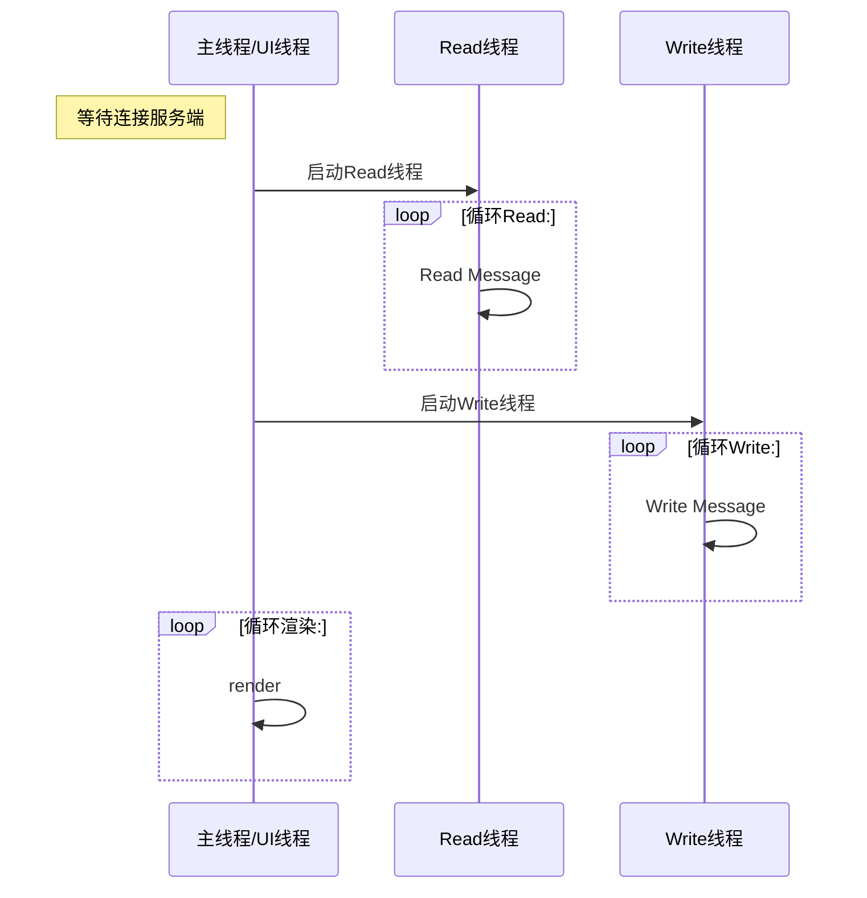

#### 服务端

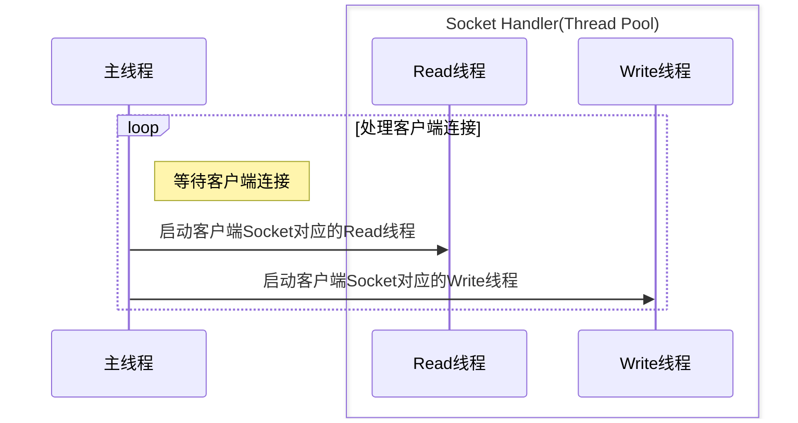

### UI

主要在客户端使用

#### 基础 UI 结构

> [!TIP]
> 点击类图里面的类跳转到详细代码

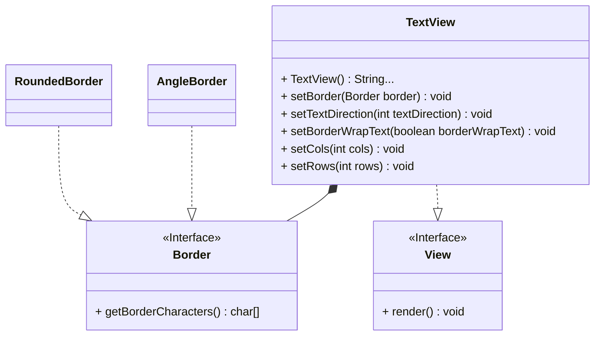

其中 `TextView` 为基础的图像类，后面的相关视图继承这个类

#### UI控制结构

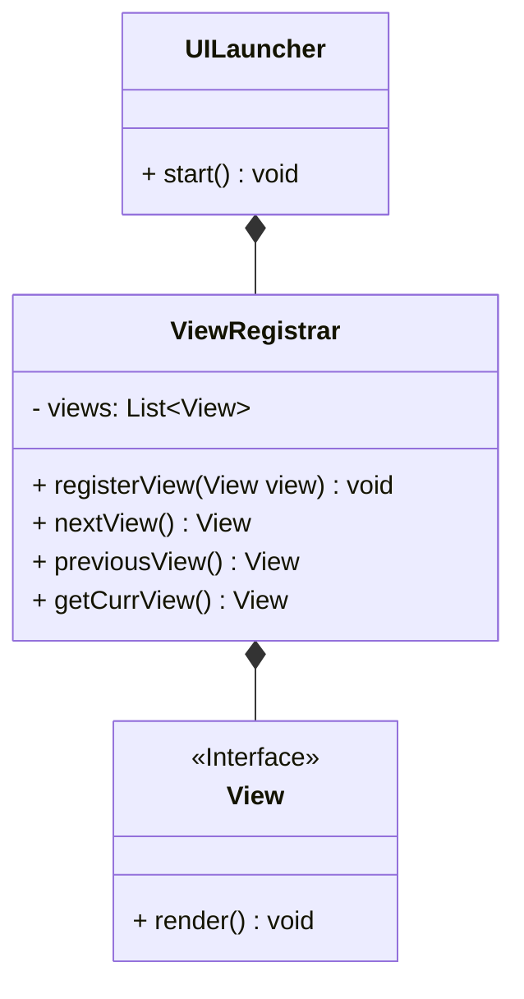

`UILauncher` 启动时将后面的业务视图注册进 `ViewRegistrar`，实现业务视图之前的跳转和数据传递

#### 业务视图

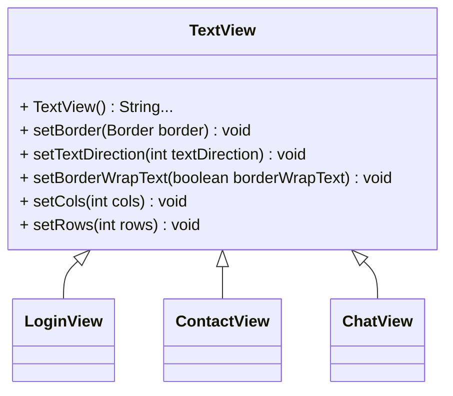

##### `LoginView`

登录视图

控制台输入 `username,password` 登录

```txt
┌────────────────────────────────────────────────┐
│ please input username and password             │
│ eg: username,password                          │
└────────────────────────────────────────────────┘
```

##### `ContactView`

联系人视图

登录成功后进入的视图

控制台输入 `r` 刷新，`q` 退出，输入对应的数字进入聊天视图

```txt
┌────────────────────────────────────────────────┐
│ 0 - chat with zs                               │
│ [r]efresh [q]uit                               │
└────────────────────────────────────────────────┘
```

##### `ChatView`

聊天视图

输入消息直接发送

`f` 进入发送文件模式

```txt
┌────────────────────────────────────────────────┐
│                  chat with ls                  │
└────────────────────────────────────────────────┘

                                         ╭───────╮
                                         │ hello │
                                         ╰───────╯

╭────╮
│ hi │
╰────╯

┌────────────────────────────────────────────────┐
│ [r]efresh [f]ile (type message to send)        │
└────────────────────────────────────────────────┘
```

发送文件模式

控制台输入 `文件路径` 发送

输入对应的 `数字` 下载文件

输入 `m` 返回消息模式

```txt
┌────────────────────────────────────────────────┐
│                  chat with zs                  │
└────────────────────────────────────────────────┘

                                         ╭───────╮
                                         │ hello │
                                         ╰───────╯

╭────╮
│ hi │
╰────╯

                        ╭────────────────────────╮
                        │ upload file: readme.md │
                        │     type 0 to download │
                        ╰────────────────────────╯

┌────────────────────────────────────────────────┐
│ [r]efresh [m]essage (type a file path to up... │
└────────────────────────────────────────────────┘
```

### Service

> [UserService](https://github.com/follow1123/java-demo/blob/main/mini-chat/src/main/org/example/minichat/service/UserService.java)

处理用户相关业务逻辑

### Model

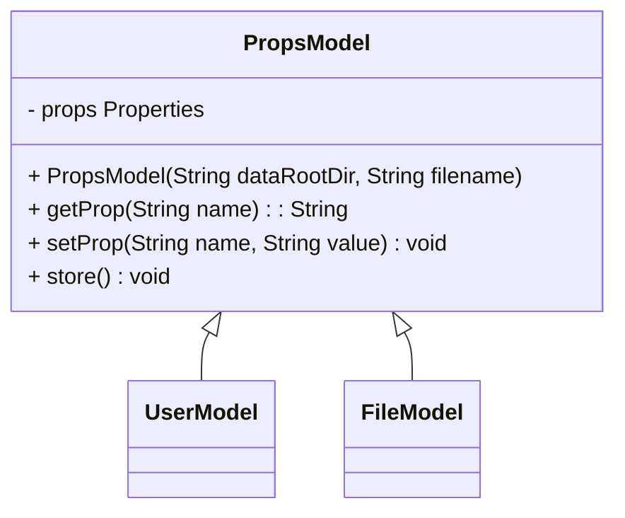

#### UserModel

保存用户数据

#### FileModel

保存用户上传和下载的文件

### Core

#### 消息

##### 报文

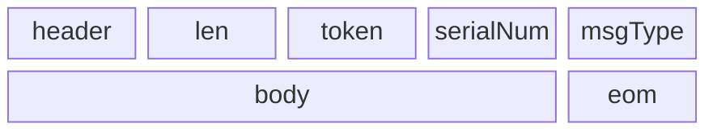

使用字符串组成，定义在 [Message](https://github.com/follow1123/java-demo/blob/main/mini-chat/src/main/org/example/minichat/core/Message.java)

使用 `&` 符号分割

- `header` - 消息头，就是字符串 `header`
- `len` - 消息长度，处理消息粘包
- `token` - 判断用户使用登录
- `serialNum` - 由于消息的发送和接收都是异步的，使用这个字段确定是响应到哪个消息
- `msgType` -
  定义消息类型，业务相关，详细类型定义在 [MsgType](https://github.com/follow1123/java-demo/blob/main/mini-chat/src/main/org/example/minichat/core/MsgType.java)
- `body` - 消息体
- `eom` - 消息结束符，就是字符串`eom`，End of Message的缩写

##### 消息总线

定义消息发送和接收逻辑

具体发送解析消息逻辑定义在 [MsgUtil](https://github.com/follow1123/java-demo/blob/main/mini-chat/src/main/org/example/minichat/utils/MsgUtil.java)

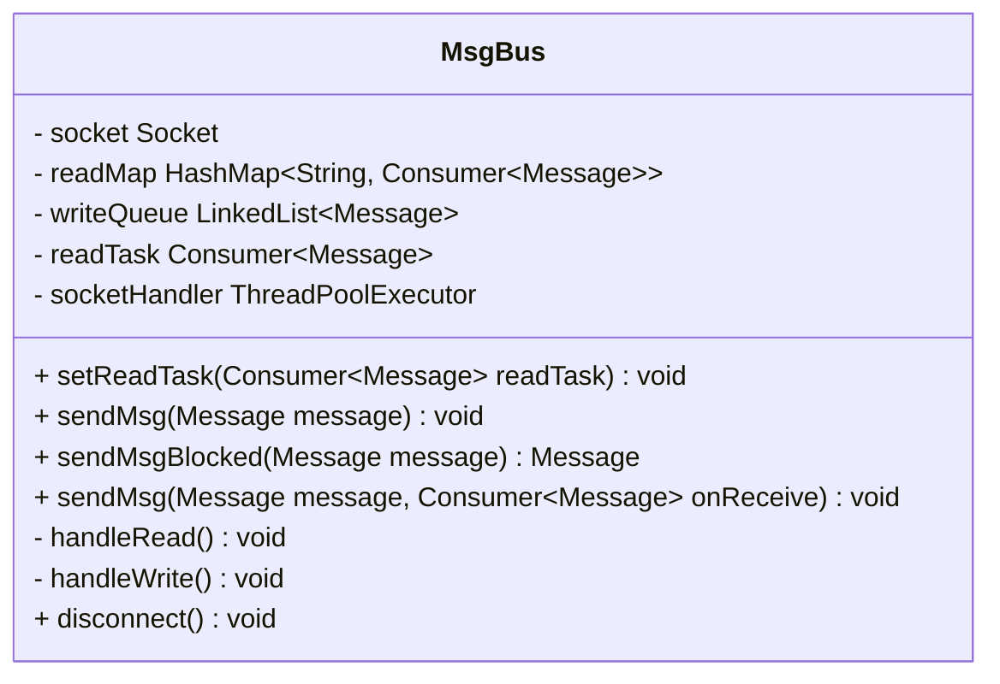

###### 初始化

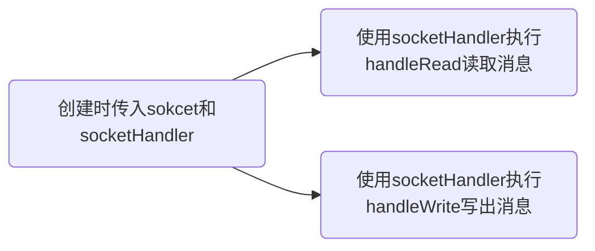

###### handleRead

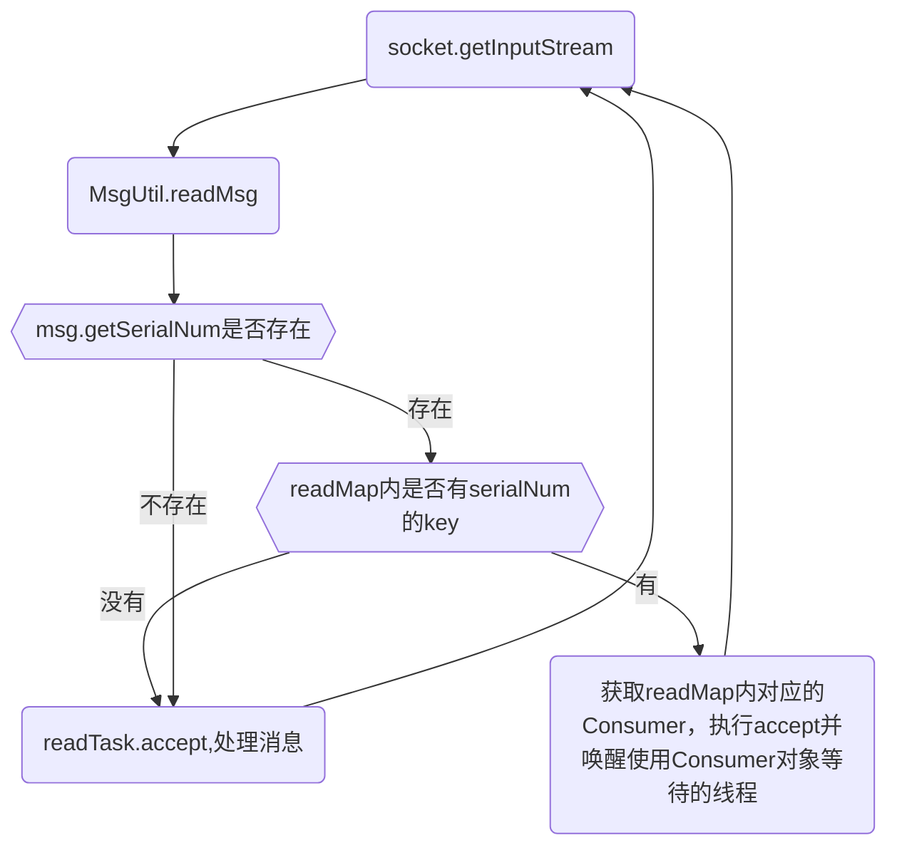

###### handleWrite

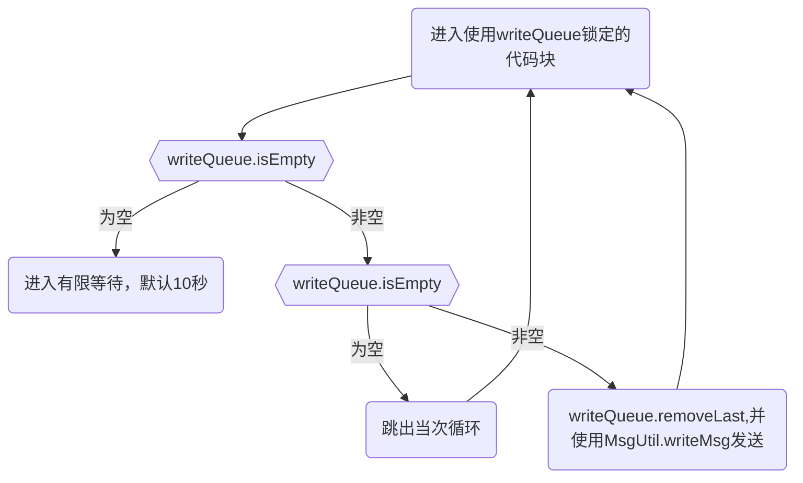

###### sendMsg

用于直接发送消息，不关心结果

1. 进入使用 writeQueue 锁定的代码块
2. 将消息添加进 writeQueue
3. 唤醒使用 writeQueue 等待的线程，就是 handleWrite 线程，唤醒后处理消息

###### sendMsgBlocked

用于发送消息，阻塞等待结果

1. 生成随机 serialNum，并存入消息内
2. 定义消息数字和 Consumer，用于接收回调方法内的数据
3. readMap.put(serialNum, consumer)
4. 进入使用使用 Consumer 锁定的代码块
5. 发送消息
6. 等待，默认 10 秒

###### disconnect

用于关闭所有资源

1. 关闭 Socket
2. 唤醒所有使用 writeQueue 等待的线程
3. 唤醒所有使用 readMap 内 Consumer 对象等待的线程
4. 如果线程池是内部创建，则关闭线程池

#### 客户端

> [Client](https://github.com/follow1123/java-demo/blob/main/mini-chat/src/main/org/example/minichat/core/Client.java)

连接客户端后将 Socket 传递给 MsgBus，并启动 UI

#### 服务端

> [Server](https://github.com/follow1123/java-demo/blob/main/mini-chat/src/main/org/example/minichat/core/Server.java)

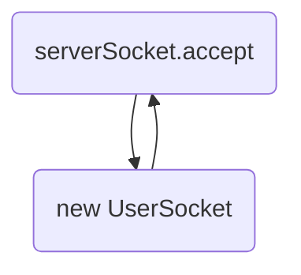

[UserSocket](https://github.com/follow1123/java-demo/blob/main/mini-chat/src/main/org/example/minichat/core/UserSocket.java)
是每个客户端的实例，配合 [UserService](#service) 和 [MsgBus](#消息总线) 处理客户端请求

### 其他

#### 工具类

- [MsgUtil](https://github.com/follow1123/java-demo/blob/main/mini-chat/src/main/org/example/minichat/utils/MsgUtil.java) -
  编解码消息并发送或接收
- [RandomUtil](https://github.com/follow1123/java-demo/blob/main/mini-chat/src/main/org/example/minichat/utils/RandomUtil.java) -
  生成 token 或 serialNum
- [SocketUtil](https://github.com/follow1123/java-demo/blob/main/mini-chat/src/main/org/example/minichat/utils/SocketUtil.java) -
  判断 Socket 状态
- [StrUtil](https://github.com/follow1123/java-demo/blob/main/mini-chat/src/main/org/example/minichat/utils/StrUtil.java) -
  处理字符串

#### 测试

由于是 demo 项目，所以测试文件直接放在项目目录下，方便测试

> [代码](https://github.com/follow1123/java-demo/blob/main/mini-chat/src/test/org/example/minichat/tests)
